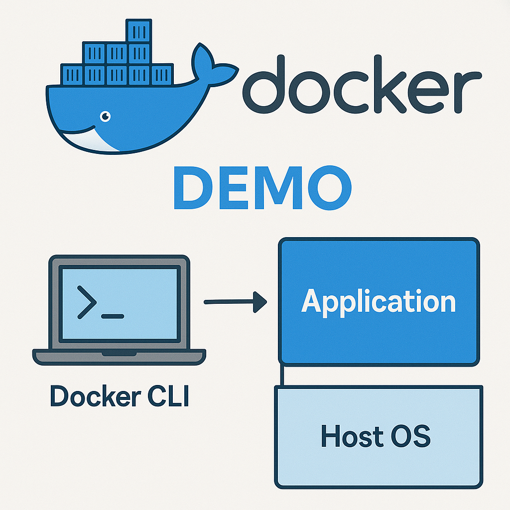

# Docker Demo

## *Docker & SaltStack Load Balancing Demo*

This project demonstrates an Infrastructure as Code (IaC) environment using Vagrant, SaltStack, Docker and Nginx.

It automatically and idempotently provisions a virtual infrastructure where a Salt Master configures a Minion to run a cluster of Nginx Web Servers inside Docker Containers behind an Nginx Load Balancer.

This project was created by [punnalathomas](https://github.com/punnalathomas) and [nlholm](https://github.com/nlholm) as group work for a configuration management systems course. A report for the creation process (including sources used) is available at [Docker Demo Documentation](https://github.com/nlholm/docker-demo-documentation).

 

The basic idea behind load balancing: a load balancer (reverse proxy) stands before a cluster of backend web servers and distributes traffic to the servers. Diagram has been created with Gemini LLM.

Please note: Unlike the general diagram above, traffic in this demo environment does not originate from the public Internet. All requests are sent locally from the Host Machine (simulating external clients) and directed to the internal Load Balancer.

## Architecture Overview

The setup consists of two Virtual Machines running Linux Debian Bookworm:
1.  **Master:** Runs the SaltStack Master service.
2.  **Minion:** Runs Salt Minion, Docker Engine, the Nginx Load Balancer (Reverse Proxy); and Nginx Web Servers within Docker Containers.

### Traffic Flow Diagram
```text
[ USER (Host Machine) ]
       |
       |  Browser Request: http://localhost:8080
       |  (Forwarded by VirtualBox to Guest Port 80)
       v
[ VIRTUAL MACHINE (Minion Node) ]
       |
       |  Nginx Load Balancer (Reverse Proxy)
       |  (Listens on Port 80)
       |
       +--- DECIDES DESTINATION (Round Robin) ---+
       |                                         |
       | (Proxies to localhost:8081)             | (Proxies to localhost:8082)
       v                                         v
[ DOCKER CONTAINER 1 ]                [ DOCKER CONTAINER 2 ] ...
     (nginx-web1)                          (nginx-web2)
 (Docker maps 8081->80)                (Docker maps 8082->80)
  [ Nginx Web Server ]                  [ Nginx Web Server ]
   (Serves: Blue Site)                   (Serves: Pink Site)
```

### Port Mapping Explained

The networking relies on a specific chain of port forwards defined in the configuration files. See [Project Structure](#project-structure) for more details.

1.  **Host Machine (e.g. Windows):** User accesses `http://localhost:8080`.
2.  **VirtualBox NAT (`Vagrantfile`):** Forwards traffic from **Host:8080** to **Minion VM:80**.
3.  **Minion VM (`nginx.conf`):** Nginx Reverse Proxy listens on **Port 80**.
4.  **Load Balancing:** Nginx Load Balancer distributes traffic to the Minion's local ports **8081, 8082, 8083**.
5.  **Docker Containers (`docker-compose.yml`):** Docker maps these local ports to **Port 80** inside each container.
6.  **Container Service:** Inside the container, the Nginx Web Server listens on **Port 80** and serves the static HTML content (from the mounted volume).

---

## Prerequisites & System Requirements

Before running the environment, ensure you have the following software installed on your host machine:

### Software
* **Vagrant** (v2.2.x or newer)
* **Oracle VirtualBox** (v6.1 or newer) - Required Provider
* **Git** (for cloning the repository)

### Hardware
* **RAM:** Minimum 8 GB recommended on the host machine.
    * Reasoning: The environment provisions two VMs (Master: 2GB, Minion: 2GB), consuming a total of 4GB RAM.
* **CPU:** Intel/AMD x86_64 architecture.

> **Important for Mac Users (Apple Silicon / M1, M2, M3):**
> This demo relies on x86_64 architecture. It is not compatible with Apple Silicon Macs using the standard VirtualBox provider. Running this on ARM-based Macs will likely fail.

---

## Installation & Setup

### 1. Clone the Repository

Clone this repository to your local machine:
```bash
git clone https://github.com/nlholm/docker-demo.git
cd docker-demo
```

### 2. Provision the Infrastructure

Start the virtual machines. We explicitly enforce the VirtualBox provider to ensure correct resource allocation.

Windows (PowerShell/CMD) / Linux / Mac (Intel):
```Bash
vagrant up
```

This process may take a few minutes as it downloads the OS image and runs the initial provisioning scripts.

### 3. Apply the Configuration (SaltStack)

Once the VMs are running, you need to verify the connection and apply the state configurations.

**Step 1**: SSH into the Master node
```Bash
vagrant ssh master
```

**Step 2**: Verify Master-Minion connection before applying changes: verify that the Minion has successfully registered with the Master.

Check accepted keys:
```Bash
sudo salt-key -L
```

You should see 'minion1' listed under 'Accepted Keys'.

Test connectivity (Ping):
```Bash
sudo salt 'minion1' test.ping
```

Expected output:
```Plaintext
minion1:
    True
```

**Step 3**: Apply the Highstate: Run the following command to trigger Docker installation and container deployment:
```Bash 
sudo salt 'minion1' state.apply
```

Running the state will take a few minutes on the first time. Expected output: Salt should return a summary report showing Succeeded: X (where X is the number of steps) and Failed: 0.

---

## Verification

1. Open your web browser on your host machine.

2. Navigate to: http://localhost:8080

3. You should see a web page served by one of the containers.

4. Refresh the page (F5) multiple times (or Ctrl + F5 for forced refresh).

Result: The background color of the page should cycle between Blue, Pink, and Yellow. This confirms that the Nginx Load Balancer is working correctly and distributing traffic to different backend containers in a Round-Robin fashion.

Alternatively, you can make a request to localhost on the command line either on the Master or on the Minion (as the VMs don't have a graphical user interface by default):

Master:
```Bash
vagrant ssh master
# Test the IP address for minion1
curl http://192.168.12.11
```

Minion:
```Bash
vagrant ssh minion1
# Test the localhost (one of the webservers will answer)
curl http://localhost
```

You can delete (`vagrant destroy`) and set the virtual machines up again (`vagrant up`) as many times as you wish. Running the command `sudo salt 'minion1' state.apply` will set up the environment in the same manner every time, idempotently. This is Infrastructure as Code with One Source of Truth.

---

## Project Structure
```Plaintext
docker-demo/
├── Vagrantfile
├── .gitattributes
├── scripts/
│   ├── master.sh
│   └── minion.sh
└── salt/
    ├── top.sls
    ├── docker/
    │   └── init.sls
    ├── nginx-proxy/
    │   ├── init.sls
    │   └── nginx.conf
    └── nginx-web/
        ├── init.sls
        ├── docker-compose.yml
        ├── site1/
        ├── site2/
        └── site3/
```

Project structure - at a glance

```Plaintext
docker-demo/
├── Vagrantfile                     # 1. NETWORKING ENTRY: Defines the VM infrastructure (Master & Minion) and maps Host Port 8080 -> Guest (Minion) Port 80.
├── .gitattributes                  # Enforces LF line endings (for Windows compatibility).
├── scripts/                        # Shell scripts for initial VM provisioning.
│   ├── master.sh                   # Provisioning: Installs Salt Master and creates a symlink from /vagrant/salt to /srv/salt.
│   └── minion.sh                   # Provisioning: Installs Salt Minion and connects it to the Master.
└── salt/                           # Main SaltStack configuration directory (synced to the Master).
    ├── top.sls                     # Entry Point: Assigns states to 'minion1'.
    ├── docker/                     # Module: Handles Docker installation.
    │   └── init.sls                # State: Installs Docker Engine & adds 'vagrant' user to docker group.
    ├── nginx-proxy/                # Module: Handles the Load Balancer.
    │   ├── init.sls                # State: Installs Nginx package on the VM.
    │   └── nginx.conf              # 2. PROXY CONFIG: Listens on Guest Port 80 (receiving traffic from Host 8080).
    └── nginx-web/                  # Module: Handles the backend web containers.
        ├── init.sls                # State: Copies site content & starts Docker Compose (i.e. Docker Containers).
        ├── docker-compose.yml      # 3. BACKEND CONFIG: Defines services (web1-3). Maps internal ports 8081-8083 -> Container Port 80. Mounts site folders.
        ├── site1/                  # Source content for Container1 (web1 - Blue Site).
        │   ├── index.html
        │   ├── styles.css
        │   └── images/
        ├── site2/                  # Source content for Container2 (web2 - Pink Site).
        │   ├── index.html
        │   ├── styles.css
        │   └── images/
        └── site3/                  # Source content for Container3 (web3 - Yellow Site).
            ├── index.html
            ├── styles.css
            └── images/
```

Project structure - in detail

In addition to this project structure overview, the provisioning and configuration files themselves are heavily commented in order to guide the reader through the demo. 

---

## Developer Note: Synced Folders

The provisioning script automatically links the local `salt/` folder to `/srv/salt/` on the Master. This means you can edit files on your host machine (e.g., in VS Code) and simply run `state.apply` on the Master to see changes instantly, without needing to copy files manually.

In case there is a need to copy files manually, do the following:
1. Clone the repository onto your Master node.
2. Create a directory for Salt modules:	`sudo mkdir -p /srv/salt`.
3. Copy the salt directory of the cloned repository into the newly created directory: `sudo cp -r docker-demo/salt/* /srv/salt/`.
4. Apply the Highstate: `sudo salt 'minion1' state.apply`.

Alternatively, in case you are using Vagrant but there is a need to copy files manually, you can navigate to /vagrant/salt on the master (i.e. the directory where Vagrant copies content from the project directory on the host) and copy the directory to /srv/salt; this is what the provisioning script automates. No need to clone the repository to the master in this alternative.

---

## Developer Note: Production vs. Demo Environment

**Why are the sites different colors?** In this educational demo, we have intentionally modified the CSS of each container (Blue, Pink, Yellow) to provide a clear visual indication that the load balancer is routing traffic to different instances.

**In a Real Production Environment:** In a real-world scenario, all backend containers would serve identical content. The goal of load balancing in production is to distribute workload, ensure redundancy, and provide high availability, while keeping the user experience consistent regardless of which specific server handles the request.

---


Load balancer in action. Picture of adventurers has been created with Gemini LLM.


