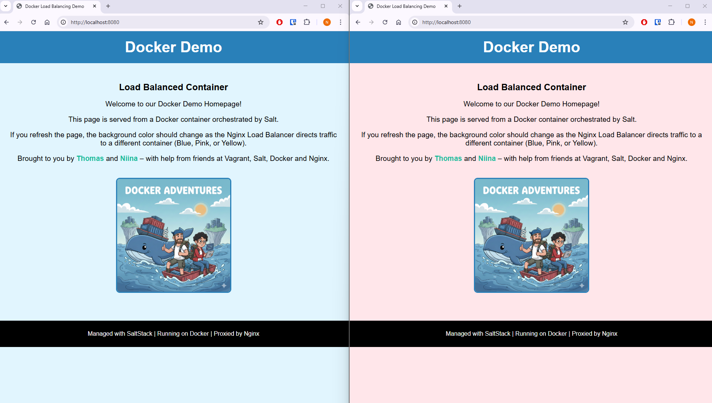

# Docker & SaltStack Load Balancing Demo

This project demonstrates an Infrastructure as Code (IaC) environment using Vagrant, SaltStack, and Docker.

It automatically provisions a virtual infrastructure where a Salt Master configures a Minion to run a cluster of Nginx web servers behind an Nginx Load Balancer.

This project was created by [punnalathomas](https://github.com/punnalathomas) and [nlholm](https://github.com/nlholm) as group work for a configuration management systems course. A report for the process is available at https://github.com/nlholm/docker-demo-documentation.

 

The basic idea behing load balancing: a load balancer (reverse proxy) stands before a cluster of backend webservers and distrubutes traffic to the servers.

## Architecture Overview

The setup consists of two Virtual Machines running Debian Bookworm:
1.  **Master:** Runs the SaltStack Master service.
2.  **Minion:** Runs Salt Minion, Docker Engine, and Nginx Reverse Proxy.

### Traffic Flow Diagram
```text
[ USER (Host Machine) ]
       |
       |  Browser Request: http://localhost:8080
       |  (Forwarded by VirtualBox to Guest Port 80)
       v
[ VIRTUAL MACHINE (Minion Node) ]
       |
       |  Nginx Load Balancer (Reverse Proxy)
       |
       +--- DECIDES DESTINATION (Round Robin) ---+
       |                                         |
       v                                         v
[ DOCKER CONTAINER 1 ]                [ DOCKER CONTAINER 2 ] ...
   (Blue Site)                           (Pink Site)
```

---

### Prerequisites

## Prerequisites & System Requirements

Before running the environment, ensure you have the following software installed on your host machine:

### Software
* **Vagrant** (v2.2.x or newer)
* **Oracle VirtualBox** (v6.1 or newer) - Required Provider
* **Git** (for cloning the repository)

### Hardware
* **RAM:** Minimum 8 GB recommended on the host machine.
    * Reasoning: The environment provisions two VMs (Master: 2GB, Minion: 2GB), consuming a total of 4GB RAM.
* **CPU:** Intel/AMD x86_64 architecture.

> **Important for Mac Users (Apple Silicon / M1, M2, M3):**
> This demo relies on x86_64 architecture. It is not compatible with Apple Silicon Macs using the standard VirtualBox provider. Running this on ARM-based Macs will likely fail.

---

## Installation & Setup

### 1. Clone the Repository

Clone this repository to your local machine:
```bash
git clone https://github.com/nlholm/docker-demo.git
cd docker-demo
```

### 2. Provision the Infrastructure

Start the virtual machines. We explicitly enforce the VirtualBox provider to ensure correct resource allocation.

Windows (PowerShell/CMD) / Linux / Mac (Intel):
```Bash
vagrant up
```

*This process may take a few minutes as it downloads the OS image and runs the initial provisioning scripts.*

### 3. Apply Configuration (SaltStack)

Once the VMs are running, you need to verify the connection and apply the state configurations.

**Step 1**: SSH into the Mater node
```Bash
vagrant ssh master
```

**Step 2**: Verify Master-Minion connection before applying changes: verify that the Minion has successfully registered with the Master.

Check accepted keys:
```Bash
sudo salt-key -L
```

You should see 'minion1' listed under 'Accepted Keys'.

Test connectivity (Ping):
```Bash
sudo salt 'minion1' test.ping
```

Expected output:
```Plaintext
minion1:
    True
```

**Step 3**: Apply the Highstate: Run the following command to trigger Docker installation and container deployment:
```Bash 
sudo salt 'minion1' state.apply
```

Expected output: Salt should return a summary report showing Succeeded: X (where X is the number of steps) and Failed: 0.

---

### Verify the Demo

1. Open your web browser on your host machine.

2. Navigate to: http://localhost:8080

3. You should see a web page served by one of the containers.

4. Refresh the page (F5) multiple times.

Result: The background color of the page should cycle between Blue, Pink, and Yellow. This confirms that the Nginx Load Balancer is working correctly and distributing traffic to different backend containers in a Round-Robin fashion.

Alternatively, you can run localhost on the command line either on the master or minion (as the VMs don't have a graphical user interface by deafult):

Master:
```Bash
vagrant ssh master
# Test the IP address for minion1
curl http://192.168.12.11
```

Minion:
```Bash
vagrant ssh minion1
# Test the localhost (one of the webservers will answer)
curl http://localhost
```

### Project Structure
```Plaintext
docker-demo/
├── Vagrantfile               # VM definition (Master & Minion)
├── .gitattributes            # Enforces LF line endings for scripts (Critical for Windows)
├── scripts/                  # Initial provisioning scripts
│   ├── master.sh             # Sets up Salt Master & Symlinks /srv/salt
│   └── minion.sh             # Sets up Salt Minion
└── salt/                     # SaltStack State Tree
    ├── top.sls               # State entry point
    ├── docker/               # Module: Installs Docker Engine
    ├── nginx-proxy/          # Module: Configures the Load Balancer
    └── nginx-web/            # Module: Deploys backend containers
        ├── docker-compose.yml
        ├── site1/            # Blue Theme Content
        ├── site2/            # Pink Theme Content
        └── site3/            # Yellow Theme Content
```

#### Developer Note: Synced Folders

The provisioning script automatically links the local`salt/` folder to `/srv/salt/` on the Master. This means you can edit files on your host machine (e.g., in VS Code) and simply run `state.apply` on the Master to see changes instantly, without needing to copy files manually.

In case there is need to copy files manually, do the following:
1. Clone the repository onto your Master node.
2. Create a directory for Salt modules:	`sudo mkdir -p /srv/salt`.
3. Copy the salt directory of the cloned repository into the newly created directory: `sudo cp -r docker-demo/salt/* /srv/salt/`.
4. Apply the Highstate: `sudo salt 'minion1' state.apply`.

---

### Note on Production vs. Demo Environment

**Why are the sites different colors?** In this educational demo, we have intentionally modified the CSS of each container (Blue, Pink, Yellow) to provide a clear visual indication that the load balancer is routing traffic to different instances.

**In a Real Production Environment:** In a real-world scenario, all backend containers would serve identical content. The goal of load balancing in production is to distribute workload, ensure redundancy, and provide high availability, while keeping the user experience consistent regardless of which specific server handles the request.



Load balancer in action


